# Taska Task & Project Management App

The Taska app UI Kit is a comprehensive Flutter UI kit designed explicitly for task and project management purposes. It offers a wide array of components and screens tailored to streamline project organization, task assignment, and productivity enhancement.

## Features

- **Streamlined Task Management:** Taska simplifies task handling by providing an array of intuitive tools and features. From task creation to assignment and tracking, it offers a seamless experience.
  
- **Project Organization:** Effortlessly manage projects with a user-friendly interface. Categorize tasks, allocate resources, and monitor project progress efficiently.
  
- **Collaborative Environment:** Foster collaboration among team members. Taska facilitates communication, file sharing, and feedback mechanisms to ensure seamless teamwork.
  
- **Customizable Components:** The UI kit comprises customizable components, allowing developers to personalize the app according to specific project needs easily.

## Screenshots

  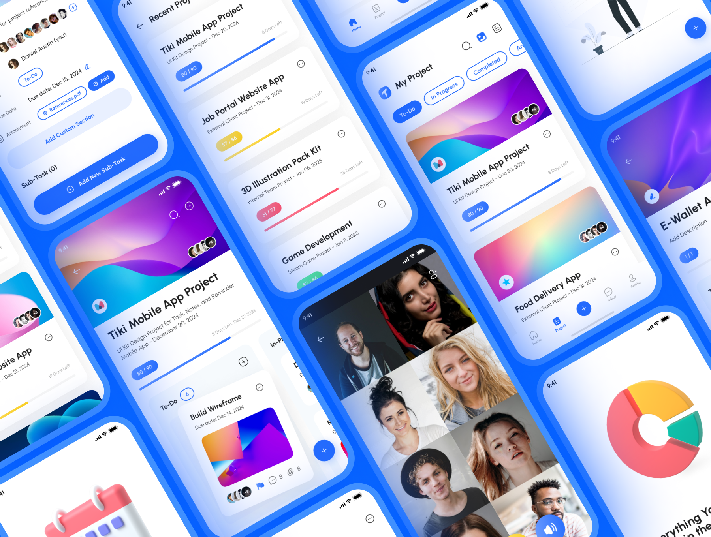
  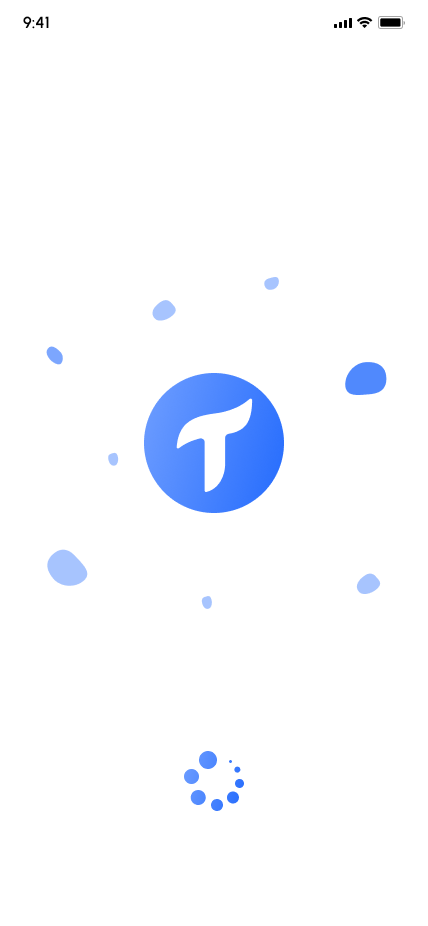
  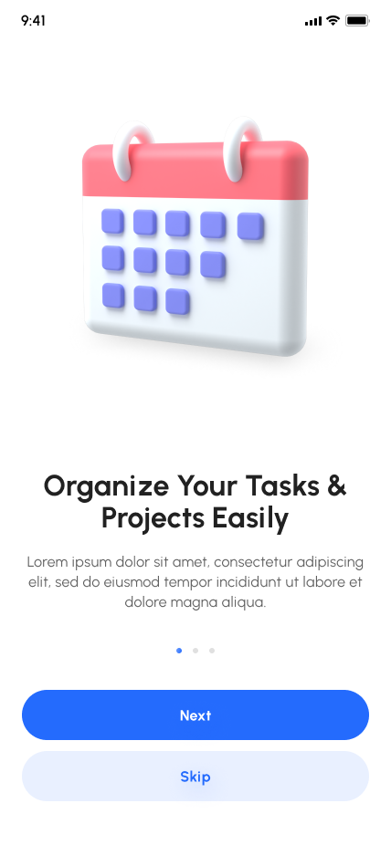

  
  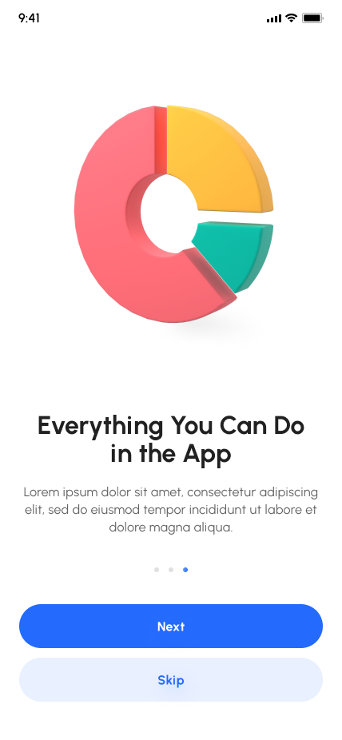
  

  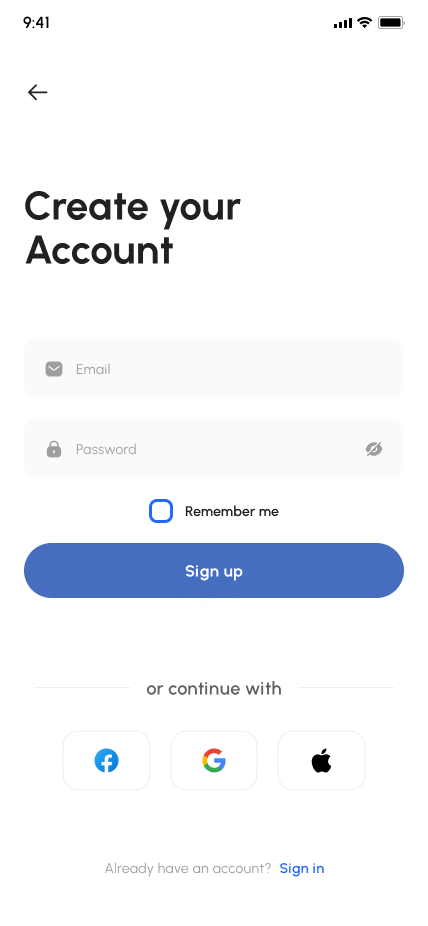

[//]: # (  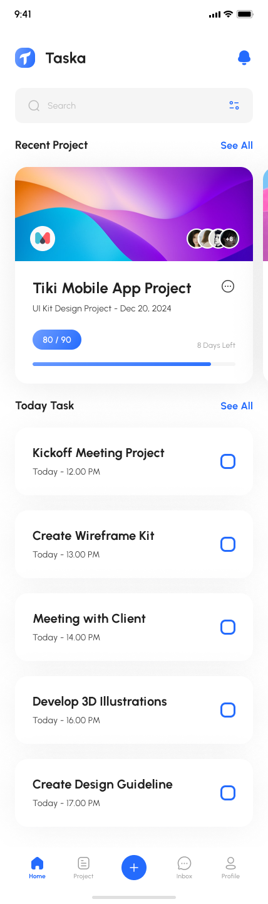)

  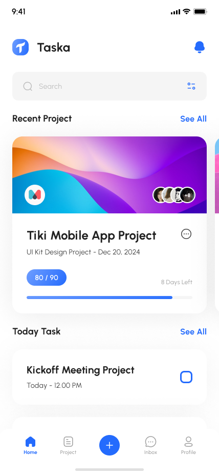

  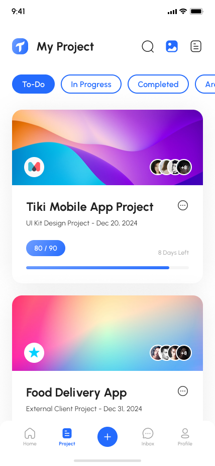

  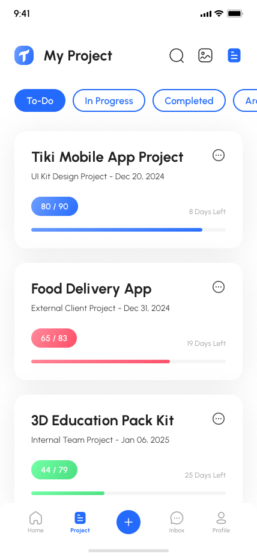
  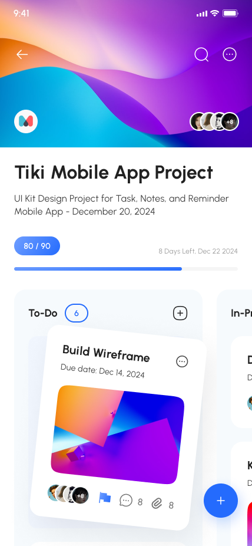
  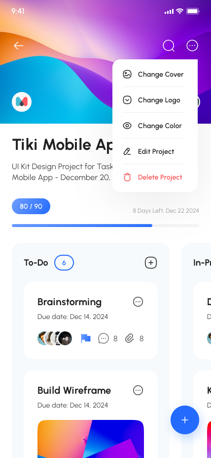

  
  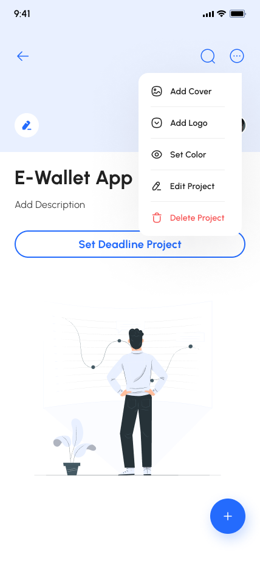
  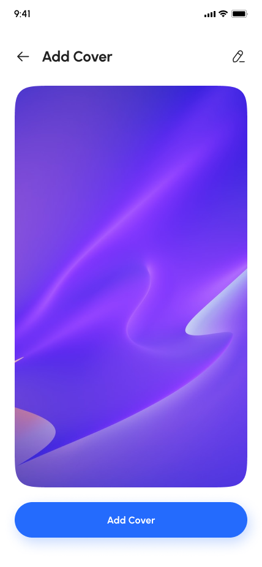

  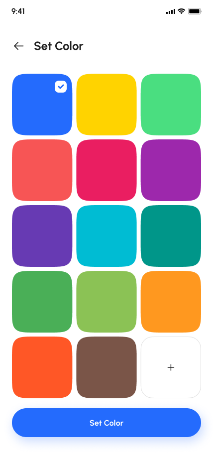
  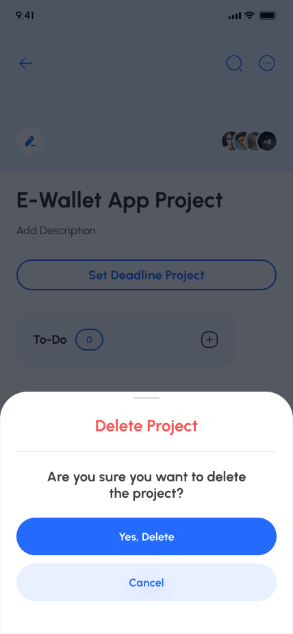
  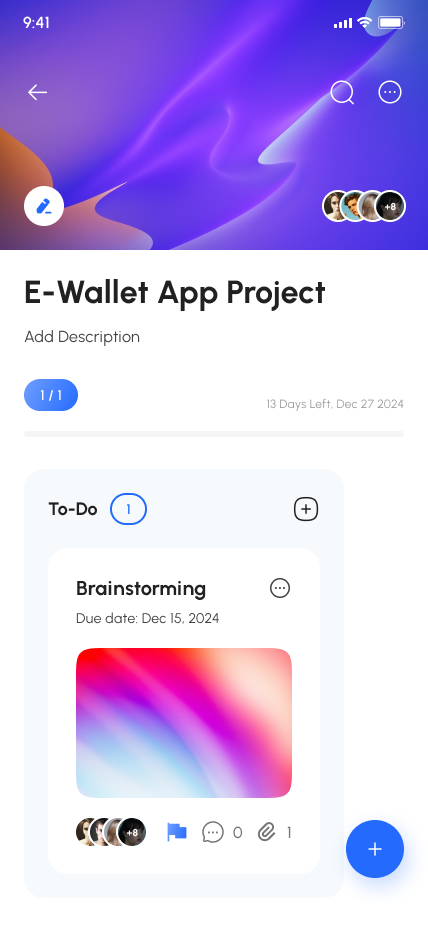

